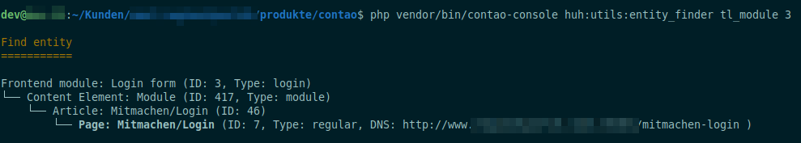

# Entity finder

A helper to find where contao entities like frontend module or content elements are located. 




## Features
- search for any entity
- extendable through event

## Usage 

```
Description:
   A command to find where an entity is included.

Usage:
   huh:utils:entity_finder <table> <id>

Arguments:
   table                 The database table
   id                    The entity id or alias (id is better supported).
```

## Supported tables (out of the box)

A list about where is searched for parent entities (recursive).

**`tl_content` (Content elements)**
- parent table

**`tl_article` (Article):**
- page
- html content element (inserttag insert_article)
- html frontend module (inserttag insert_article)

**`tl_block_module` (Block Element child)**
- parent block

**`tl_block` (Block)**
- block frontend module

**`tl_module` (Frontend Modules):**
- module content element
- html content element (inserttag insert_module)
- Layouts

**`tl_layout` (Layout):**
- Themes

**`tl_news` (News)**
- news archive (`pid`)

**`tl_news_archive` (News archive)**
- newslist frontend module

**`tl_theme` (Themes)**

**`tl_page` (Pages)**

## Extend 

You can extends the finder command to support additional entities. 
Use `ExtendEntityFinderEvent::addParent()` to add parent entites 
and `ExtendEntityFinderEvent::setOutput()` for a nice output of the current entity.

```php
<?php

namespace App\EventListener;

use Contao\ContentModel;
use Contao\ModuleModel;
use HeimrichHannot\UtilsBundle\Event\ExtendEntityFinderEvent;
use Symfony\Component\EventDispatcher\EventSubscriberInterface;

class ExtendEntityFinderSubscriber implements EventSubscriberInterface
{
    public static function getSubscribedEvents()
    {
        return [
            ExtendEntityFinderEvent::class => 'onExtendEntityFinderEvent'
        ];
    }

    public function onExtendEntityFinderEvent(ExtendEntityFinderEvent $event)
    {
        switch ($event->getTable()) {
            case CustomModel::getTable():
                $entity = CustomModel::findByPk($event->getId());

                if (!$entity) {
                    return;
                }
                $event->addParent(CustomArchiveModel::getTable(), $entity->pid);
                
                $elements = ContentModel::findBy(
                    ['type=?','customEntity=?'], 
                    ['custom_entity', $entity->id]
                );
                
                if ($elements) {
                    foreach ($elements as $element) {
                        $event->addParent(ContentModel::getTable(), $element->id);
                    }
                }
                
                $event->setOutput('Custom entity: '.$entity->title.' (ID: '.$entity->id.')');

                break;

            case CustomArchiveModel::getTable():
                $archive = CustomArchiveModel::findByPk($event->getId());

                if ($archive) {
                    // has no parents, so no addParent() call is needed
                    $event->setOutput('Custom entity archive: '.$archive->title.' (ID: '.$archive->id.')');
                }

                break;

            // you can also extend other tables to add additional search parameters
            case ModuleModel::getTable():
                $model = ModuleModel::findByPk($event->getId());
                
                $parents = CustomModel::findBy(
                    ['includeModule=?'], 
                    [$model->id]
                );
                
                if ($parents) {
                    foreach ($parents as $element) {
                        $event->addParent(CustomModel::getTable(), $element->id);
                    }
                }
                
                break;
        }
    }
}

```