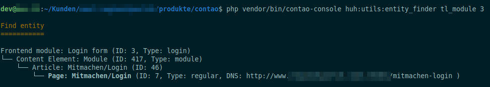

# Entity finder

A helper to find where contao entities like frontend module or content elements are located. 




## Features
- search for any entity
- extendable through event

## Usage 

```
Description:
   A command to find where an entity is included.

Usage:
   huh:utils:entity_finder <table> <id>

Arguments:
   table                 The database table
   id                    The entity id or alias (id is better supported).
```

## Supported tables (out of the box)

A list about where is searched for parent entities (recursive). There is a fallback for non supported tables based on parent tables and ids.

* tl_content
* tl_article
* tl_block_module
* tl_block
* tl_form
* tl_form_field
* tl_module
* tl_layout
* tl_list_config
* tl_list_config_element
* tl_news
* tl_news_archive
* tl_theme
* tl_page

## Extend 

You can add support for additional entities by listening to the `EntityFinderFindEvent` event.

```php
<?php

namespace App\EventListener;

use HeimrichHannot\UtilsBundle\EntityFinder\Element;
use HeimrichHannot\UtilsBundle\Event\EntityFinderFindEvent;
use Symfony\Component\EventDispatcher\Attribute\AsEventListener;
use Vendor\Bundle\NewsCategoryFinder;
use Vendor\Bundle\NewsCategoryModel;

class EntityFinderFindEventListener
{
    private readonly NNewsCategoryFinder $newsCategoriesFinder;

    #[AsEventListener(EntityFinderFindEvent::class)]
    public function __invoke(EntityFinderFindEvent $event): void
    {
        if (!$event->getTable() === 'tl_news_category' || $event->getElement()) {
            return;
        }

        $category = NewsCategoryModel::findByPk($event->getId());
        if (!$category) {
            return;
        }

        $event->setElement(new Element(
            $event->getTable(),
            $event->getId(),
            'News Category '.$category->title.' (ID: '.$category->id.')',
            (function () use ($category): \Generator {
                foreach ($this->newsCategoriesFinder->findNewsByCategory($category) as $news) {
                    yield ['table' => 'tl_news', 'id' => $news->id];
                }
            })()
        );
    }
}
```